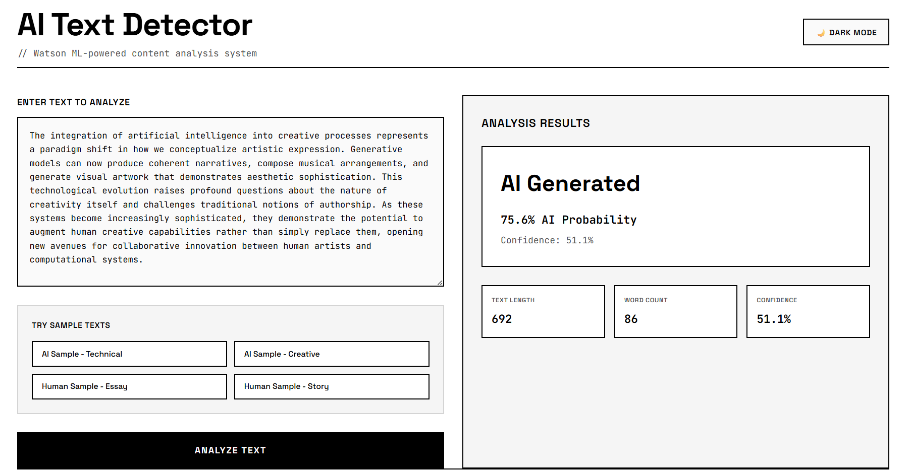
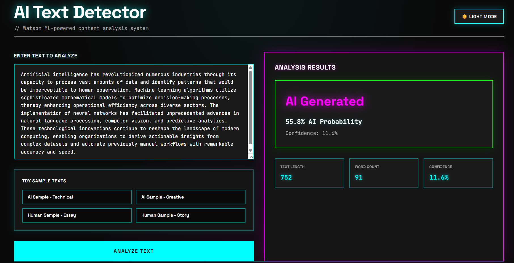
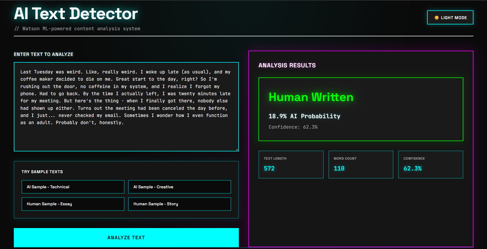

# 🤖 AI Text Detection System

> Binary classification system to distinguish AI-generated text from human-written content using IBM Watson Machine Learning

[](https://www.ibm.com/watson)
[](https://nodejs.org/)
[](LICENSE)

## 📋 Table of Contents
- [Overview](#overview)
- [Features](#features)
- [Tech Stack](#tech-stack)
- [Installation](#installation)
- [Usage](#usage)
- [Model Performance](#model-performance)
- [Project Structure](#project-structure)
- [Contributors](#contributors)

## 🎯 Overview

This Bachelor of Engineering project addresses the critical challenge of distinguishing AI-generated text from authentic human writing. Using IBM Watson's AutoAI framework, we trained and evaluated 19 machine learning pipelines, achieving **79.5% F1-score** and **87% ROC-AUC** with our best XGBoost classifier.

## ✨ Features

- 🔍 **Real-time Analysis**: Instant text classification with confidence scores
- 🎨 **Dark Mode**: Neon-themed brutalist UI with responsive design
- 📊 **Detailed Metrics**: Probability distributions and classification stats
- 🚀 **Fast Inference**: <1 second response time
- 🔐 **Secure**: Environment-based configuration for API credentials
- 📱 **Responsive**: Desktop and mobile optimized

## 🛠️ Tech Stack

**Frontend:**
- HTML5, CSS3 (Grid, Flexbox)
- Vanilla JavaScript (ES6+)
- Custom Fonts: Space Grotesk, JetBrains Mono

**Backend:**
- Node.js (v18.x)
- Express.js (v4.18.2)
- Axios (v1.4.0)

**Machine Learning:**
- IBM Watson AutoAI
- XGBoost Classifier
- Scikit-learn
- Natural Language Processing (TF-IDF, N-grams)

## 📦 Installation

### Prerequisites
- Node.js 18.x or higher
- IBM Cloud account with Watson ML service
- Git

### Setup

1. **Clone the repository**
git clone https://github.com/yourusername/ai-text-detection.git
cd ai-text-detection
2. **Install dependencies**
npm install
3. **Configure environment variables**
Copy example env file
cp .env.example .env

Edit .env with your credentials
IBM_API_KEY=your_watson_api_key_here
WATSON_ML_URL=your_watson_ml_endpoint
4. **Start the server**
node proxy-server.js
5. **Open the application**
Open index.html in your browser
Or use Live Server extension in VS Code

## 🚀 Usage

1. **Enter or paste text** in the input textarea (minimum 50 characters)
2. **Try sample texts** using the provided buttons (AI/Human examples)
3. **Click "Analyze Text"** to get classification results
4. **View results** including:
   - Binary classification (AI/Human)
   - Confidence score
   - Probability distribution
   - Text statistics

## 📸 Screenshots

<div align="center">
  
### Light Mode


### Dark Mode - Split Screen Analysis
 

*Responsive web interface with real-time classification and neon-themed dark mode*

</div>


### Key Features Showcased:
- ✅ Real-time text analysis with <1s response time
- ✅ Split-screen layout for side-by-side comparison (desktop)
- ✅ Confidence scores and probability distributions
- ✅ Sample texts for quick testing
- ✅ Responsive design (mobile & desktop optimized)


## 📊 Model Performance

**Best Model: Pipeline 4 (XGBoost)**

| Metric | Score |
|--------|-------|
| F1-Score | 79.5% |
| ROC-AUC | 87.0% |
| Accuracy | 79.0% |
| Precision | 78.0% |
| Recall | 83.0% |

**Dataset:**
- Source: [Kaggle - AI vs Human Text Detector](https://www.kaggle.com/datasets/atharvalandge/ai-vs-human-text-detector)
- Size: 11,000+ samples (balanced)
- Train-Test Split: 80/20
- Cross-Validation: 5-fold stratified

**Training:**
- 19 pipelines evaluated
- Build time: ~7 minutes
- Enhancements: TFE, HPO-1, FE, HPO-2

## 📁 Project Structure

```AiDetector/
├── .git/                      # Git version control
├── node_modules/              # Dependencies (gitignored)
│
├── screenshots/               # UI screenshots
│   ├── dark-ai.png
│   ├── dark-human.png
│   └── light-mode.png
│
├── .env                       # Environment variables (gitignored)
├── .env.example               # Environment template
├── .gitignore                 # Git ignore rules
├── index.html                 # Frontend application
├── package.json               # Dependencies & scripts
├── package-lock.json          # Dependency lock
├── proxy-server.js            # Backend server
├── README.md                  # Project documentation
└── LICENSE                    # MIT License
```
## 🙏 Acknowledgments

- IBM Watson Machine Learning team for AutoAI platform
- Kaggle community for the dataset

**Made with ❤️ for academic integrity and content authenticity**